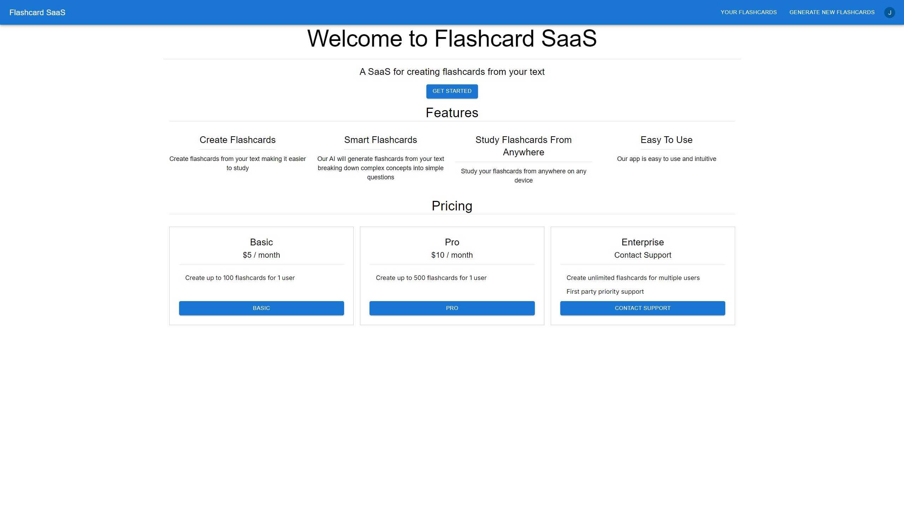

# Flashcard SaaS

## Table of Contents

- [Description](#description)
- [Installation](#installation)
- [Usage](#usage)
- [Learn More](#learn-more)
- [Deploy to Vercel](#deploy-on-vercel)
- [Contributing](#contributing)
- [License](LICENSE)

## Description


Flashcard SaaS is a web-based application designed to help users create, manage, and study flashcards. It aims to enhance learning efficiency by providing an easy-to-use platform for organizing study materials.

## Installation

1. **Clone the repository:**
    ```bash
    git clone https://github.com/kjunghoan/flashcard-saas.git
    cd flashcard-saas
    ```

2. **Install dependencies:**
    ```bash
    npm install
    ```

## Usage

1. **Create API keys:**
    - Go to [OpenAI's website](https://platform.openai.com/) and create an API key.
    - [Create an API key set for Clerk](https://clerk.com/).
    - [Create an API key set for Stripe](https://stripe.com/).

2. **Set environment variables:**
    - Fill out the environment variables in `.env.local`
    (The expected variables are listed under `example.env.local`.

3. **Verify tests:**
    ```bash
    npm test
    ```

4. **Run the development server:**
    ```bash
    npm run dev
    ```

5. **Build for production:**
    ```bash
    npm run build
    ```

6. **Run the production server:**
    ```bash
    npm run start
    ```

## Learn More

To learn more about Next.js, take a look at the following resources:

- [Next.js Documentation](https://nextjs.org/docs) - Learn about Next.js features and API.
- [Learn Next.js](https://nextjs.org/learn) - An interactive Next.js tutorial.

You can check out [the Next.js GitHub repository](https://github.com/vercel/next.js/) - Your feedback and contributions are welcome!

## Deploy on Vercel

1. **Fork this repository.**
2. **Sign up for a [Vercel](https://vercel.com/) account** if you don't have one.
3. **Connect your GitHub repository to Vercel.**
4. **Deploy your project** by following the instructions on Vercel.

## Contributing

To contribute to the Flashcard SaaS application, please follow these steps:

1. **Fork the repository and clone it to your local machine.**
2. **Create a new branch for your changes:**
    ```bash
    git checkout -b feature_or_bugfix/your-feature-name
    ```
3. **Make your desired changes to the codebase.**
4. **Test your changes locally to ensure they work as expected.**
5. **Make sure all of your tests are passing.**
6. **Commit your changes with a descriptive commit message in past tense:**
    ```bash
    git commit -m "Added feature/fix: Description of your changes"
    ```
7. **Push your changes to your forked repository:**
    ```bash
    git push origin feature/your-feature-name
    ```
8. **Open a pull request** on the original repository, explaining your changes and why they should be merged.

Thank you for contributing to the Flashcard SaaS application!

## License

This project is licensed under the MIT License - see the [`LICENSE`](LICENSE) file for details.